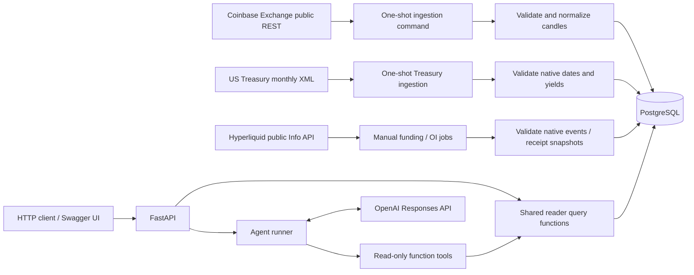
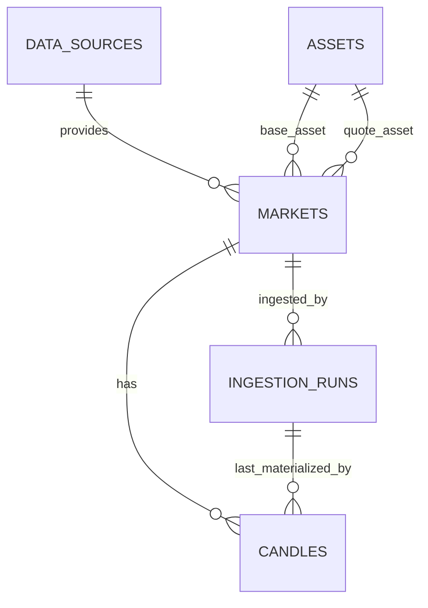
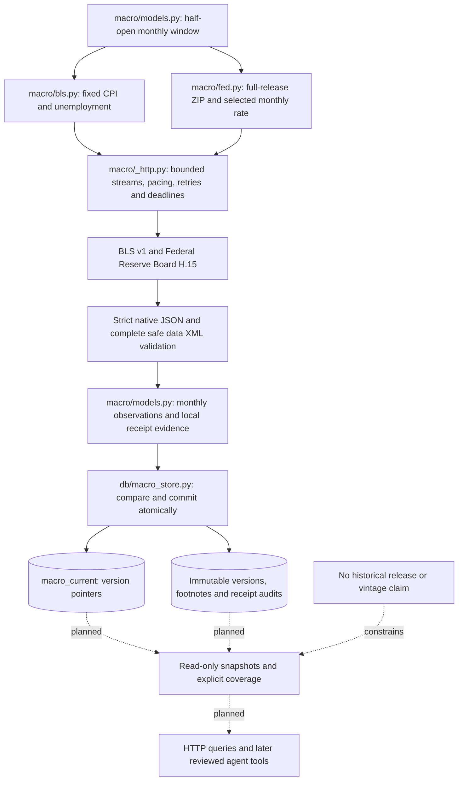
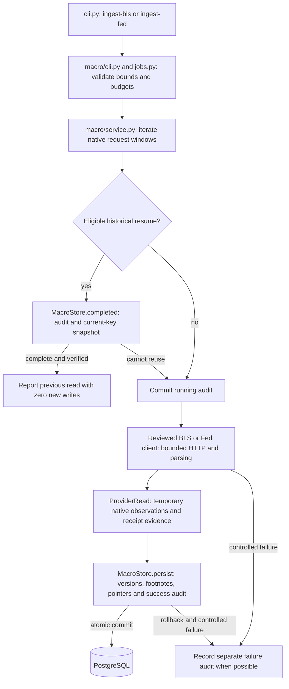

# Application architecture

Status: **reviewed; Milestone 1's local vertical slice is implemented and verified, including manually inspected live-agent answers.**

The Treasury provider boundary, dedicated schema, monthly ingestion, read-only queries/API, and bounded agent tools are implemented. Their native data contract and limitations are described in section 12. Treasury agent execution is verified with simulated model responses and separately inspected live acceptance checks.

The reviewed contract uses Coinbase spot BTC/USD, five-minute candles, and retained history from 2020-01-01 with earlier dates configurable. The local data path and agent loop are implemented. The initial backfill completed with independently verified source gaps; README records ingestion, HTTP, deterministic tests, and separately inspected live-agent verification. Material direction changes remain reviewable.

## 1. Goal and scope

Prove a complete local path from a public market-data source to a grounded answer: fetch BTC candles, validate and normalize them, persist them reproducibly, query them through HTTP, and let an OpenAI model select read-only tools backed by those same queries.

Approved data contract: **Coinbase Exchange spot BTC/USD, completed five-minute OHLCV candles, history from 2020-01-01 through the latest eligible candle, and explicit manual refreshes**. This describes one venue's market, not a consolidated Bitcoin price. Retain all ingested history; there is no rolling 90-day retention limit. Derive fifteen-minute, hourly, and daily bars from the stored five-minute candles rather than ingesting duplicate representations.

Confirmed requirements: Coinbase spot BTC/USD, five-minute storage, and the initial 2020 start are accepted; the agent must answer questions about 2024 and earlier where source data permits. Earlier starts remain configurable. The initial 90-day dataset was a demo-sized assumption superseded by the historical requirement.

Milestone 1 covers OHLCV, latest stored close, window summaries, ingestion reliability, migrations, local containers, and tests. It does not include live ticks, scheduled orchestration, other assets or providers, trading, forecasting, RAG, streaming infrastructure, MCP, an evaluation platform, or cloud deployment. Future scope is reviewed separately.

## 2. Runtime boundaries and data flow

Use one installable Python package and one application image. Run that image with different commands for the API, migrations, and ingestion. PostgreSQL is the second persistent service. The ingestion and migration commands are short-lived jobs, not additional permanent services.



| Boundary | Responsibility | Explicit limit |
| --- | --- | --- |
| Source client | HTTP requests, bounded time windows, timeouts, retry classification, response decoding | Knows the Coinbase wire format; performs no database writes |
| Ingestion service | Closed-candle policy, validation, deduplication, audit run, transactional persistence | Called from a CLI; does not start automatically inside FastAPI |
| Persistence modules | Table definitions, connections, parameterized upserts and selects | PostgreSQL-specific behavior is visible rather than hidden behind generic repository interfaces |
| Market query functions | Time-range rules, deterministic calculations, coverage and provenance | Used by both API routes and agent tools |
| FastAPI routes | Validate transport inputs, map errors, serialize results | No duplicated analytical logic |
| Agent runner | Call OpenAI, validate requested functions, execute tools, return an answer and evidence | Cannot write data, generate SQL, browse, ingest, or execute arbitrary code |

Example: a request to `POST /v1/agent/query` asks for BTC's change over the latest 24 complete hours. The server supplies its UTC clock and supported market context to the model. The model requests the summary tool; application code validates its arguments, invokes the shared query function, and reads PostgreSQL. The result includes the exact window, decimal metrics, source, coverage, and freshness. The runner returns that result to OpenAI, then responds with the explanation plus the actual evidence used.

The agent does not make an HTTP request to its own API. Reusing the query function keeps API and tool behavior consistent without introducing an internal network dependency. A later independently deployed agent or MCP client can justify a transport boundary.

## 3. Public source selection

Recommend the **Coinbase Exchange REST API**, specifically `GET /products/BTC-USD/candles`, rather than Coinbase Advanced Trade. Public candle requests require neither credentials nor a paid data subscription. The endpoint supports five-minute, fifteen-minute, and hourly buckets, limits requests to 300 candles, can return buckets preceding the requested start, and warns that history may be incomplete. Its limit applies to a request, not to the total history stored locally. Historical candles are unsuitable for frequent real-time polling. [Coinbase candle reference](https://docs.cdp.coinbase.com/api-reference/exchange-api/rest-api/products/get-product-candles).

On 2026-10-03, three unauthenticated requests from the development machine returned HTTP 200 and all twelve expected five-minute candles for the sampled UTC windows 00:00-01:00 on 2024-01-01, 2020-01-01, and 2017-01-01. This confirms access to those samples only; it neither establishes the earliest available date nor certifies uninterrupted coverage between them. Older history can be requested explicitly after availability checks. The 2020-to-2026 backfill and independent stored-coverage measurements completed on 2026-10-05; README records the observed gaps and precise range. The endpoint is free to fetch at this scope; local compute/storage and OpenAI usage have their own costs.

Public Exchange limits are enforced per IP and return HTTP 429 on throttling. Use conservative sequential requests, bounded retries, and any applicable retry guidance rather than approaching the published ceiling. [Coinbase rate limits](https://docs.cdp.coinbase.com/exchange/rest-api/rate-limits).

| Alternative | When it would be reasonable | Trade-off for this slice |
| --- | --- | --- |
| Hyperliquid candle API | Recent perpetual-market analysis, funding/open-interest enrichment, or an ongoing feed | Its candle snapshot endpoint retains only the latest 5,000 candles: about 17.4 days at five minutes, 52.1 days at fifteen minutes, or 208.3 days hourly. Pagination cannot recover candles outside that retained range, so the direct intraday API does not meet the requirement to reach 2024. [Hyperliquid candle reference](https://hyperliquid.gitbook.io/hyperliquid-docs/for-developers/api/info-endpoint) |
| Kraken public OHLC | A small recent-history demo or a deliberate Kraken venue choice | The endpoint exposes at most 720 recent entries and includes the unfinished current bucket; it cannot backfill older candles through `since`, so it does not meet the multi-year requirement through this endpoint. [Kraken reference](https://docs.kraken.com/api-reference/market-data/get-ohlc-data) |
| An aggregate vendor such as CoinGecko | The goal is an aggregate market price rather than exchange-specific OHLCV | Requires a separate review of the chosen plan, authentication, history, granularity, and volume semantics; it is not an interchangeable candle feed |
| Another exchange such as Binance | A specific venue or BTC/stablecoin market is the desired subject | Requires reviewing availability and terms for the user's environment; BTC/USDT also changes the quote-asset meaning |

Hyperliquid's archive provides other historical datasets rather than ready-made candles; documented downloads can incur requester-paid transfer costs. Reconstructing bars from historical trade/fill records or selecting a third-party historical provider is a separate ingestion project, with coverage and deduplication work. It is reasonable if Hyperliquid perpetuals become the primary research subject, but is additional scope for this first slice. [Hyperliquid historical data](https://hyperliquid.gitbook.io/hyperliquid-docs/historical-data).

Venue liquidity has not been ranked in this proposal. A liquid perpetual may be the right instrument for derivatives research, but spot versus perpetual is a change of market semantics, not merely a quote-asset substitution. Model traded price separately from mark/index prices and funding; quote denomination, collateral, and settlement assets are distinct. For example, Hyperliquid documents USDC collateral with USDT-denominated contracts for its main perpetual convention. [Hyperliquid contract specifications](https://hyperliquid.gitbook.io/hyperliquid-docs/trading/contract-specifications). Compare liquidity using a defined venue, date, spread/depth, and volume metric if it becomes a selection requirement. Add Hyperliquid funding/open-interest data as a candidate in Milestone 2.

The implemented client verifies product metadata (`BTC-USD`, base BTC, quote USD, margin disabled), reads the documented `time, low, high, open, close, volume` order, and stores **base-asset volume in BTC**. A live check on 2026-10-05 reconciled the 11:55–12:00 UTC candle's **17.88862151** volume exactly to the sum of **1,310** public trades' BTC `size` values. This is empirical evidence for that sample, not a universal historical coverage guarantee or a claim that the candle documentation explicitly names the volume unit. BTC and USD product identifiers are documented in the [product reference](https://docs.cdp.coinbase.com/api-reference/exchange-api/rest-api/products/get-single-product).

Do not promise uninterrupted availability or complete history. If the source cannot satisfy the backfill, report the missing coverage and revisit the source decision; do not silently substitute another venue. Public access also does not establish redistribution rights: check relevant provider terms before publishing datasets or a hosted data service. The public repository should contain small synthetic fixtures, not downloaded history.

### Resolution and historical depth

Hourly bars minimize initial HTTP requests and simplify the first demo, but there is no storage or architecture requirement forcing that choice. Five-minute bars preserve intrahour moves that cannot be reconstructed from hourly OHLCV. Fifteen-minute bars are a reasonable compromise if those finer moves do not matter. Completed finer bars also reduce the unavoidable age of the latest stored close; refresh execution remains manual in Milestone 1.

For the complete UTC years 2024 and 2025 (731 days), before source gaps:

| Stored resolution | Candle rows | Approximate requests using 250 buckets/request |
| --- | ---: | ---: |
| One hour | 17,544 | 71 |
| Fifteen minutes | 70,176 | 281 |
| Five minutes | 210,528 | 843 |

These are calculated planning estimates excluding chunk-boundary overhead and retries, not measured throughput or guaranteed provider counts. The initial five-minute range from 2020-01-01 to 2026-10-03 00:00 UTC has 710,496 expected buckets. That is a modest dataset for ordinary PostgreSQL; loading time and replay/recovery are more important concerns here than scaling infrastructure.

Store one canonical five-minute series. Derive a coarser candle using the first constituent open, maximum high, minimum low, last close, and sum of volume. All required five-minute constituents must exist before labeling the derived candle complete. Do not average prices into OHLCV, upsample an hourly candle into finer observations, or store duplicate resolutions without a measured need. The agent receives calculated summaries and coverage, not the whole historical dataset in its context.

## 4. Repository structure

The following Milestone 1 files exist now. Add later directories only when they contain useful implementation, rather than generating empty scaffolds.

```text
ai-market-intelligence/
  README.md
  ARCHITECTURE.md
  AGENTS.md
  .gitignore
  .env.example
  .dockerignore                 # exclude .env, secrets, datasets, logs, and .git
  pyproject.toml                # dependencies, Ruff, mypy, pytest configuration
  uv.lock
  .python-version
  Dockerfile
  compose.yaml
  compose.test.yaml             # independent disposable PostgreSQL test project
  alembic.ini
  migrations/
    env.py
    versions/
  scripts/
    init_local_env.py           # ignored random local credentials, no overwrite
    check_coinbase_live.py      # opt-in historical samples, no database access
    check_market_api.py         # opt-in local HTTP checks, no database writes
  src/
    market_intelligence/
      __init__.py
      __main__.py
      config.py
      cli.py                    # standard-library argparse entry point
      api.py                    # FastAPI transport, lifespan, safe errors, health
      db/
        connection.py
        tables.py
        setup.py                # role provisioning and explicit grants
        candle_store.py         # monthly persistence, audit, and writer lock
      ingestion/
        __init__.py
        models.py               # exact candle validation and UTC windows
        coinbase.py             # public HTTP contract, paging, and bounded retries
        service.py              # fetch/validate/commit and explicit resume
      queries/
        __init__.py
        models.py               # evidence schemas, UTC grids, bound cursors
        service.py              # repeatable read-only snapshots and SQL analytics
  tests/
    conftest.py
    unit/
    integration/
```

Implemented `agent/` modules are `runner.py`, `tools.py`, `models.py`, and `instructions.py`. Provider tests use synthetic wire rows; agent tests use the real SDK with an in-memory HTTP transport. Query/agent integration tests use guarded PostgreSQL and reader credentials. The HTTP module keeps routes and lifespan together; split it when additional complexity warrants it. Use `assets/` only when static resources exist. No generic provider plugin system, base services, event bus, dependency-injection framework, or future-component directories are needed. FastAPI's normal dependency functions provide shared services.

## 5. Initial PostgreSQL model

The grain is **one candle per venue market, interval, and UTC bucket start**. A BTC/USD pair alone is insufficient because two exchanges may report different prices and volumes.

### Implemented foundation tables

| Table | Fields and keys | Purpose |
| --- | --- | --- |
| `data_sources` | `code text PRIMARY KEY`, `name text NOT NULL` | Source identity; initially one row, `coinbase_exchange` |
| `assets` | `code text PRIMARY KEY`, `name text NOT NULL`, `kind text NOT NULL CHECK kind IN ('crypto', 'fiat')` | Initially BTC and USD; this small namespace is local to the slice, not a universal security master |
| `markets` | `id bigint GENERATED ALWAYS AS IDENTITY PRIMARY KEY`, `source_code text FK`, `source_product_id text`, `base_asset_code text FK`, `quote_asset_code text FK`; all non-null; unique `(source_code, source_product_id)`; base differs from quote | Venue-specific spot market and explicit units; initially Coinbase's BTC-USD |
| `candles` | `market_id bigint FK`, `interval_seconds integer`, `opened_at timestamptz`, `open numeric(38,18)`, `high numeric(38,18)`, `low numeric(38,18)`, `close numeric(38,18)`, `base_volume numeric(38,18)`, `first_ingested_at timestamptz`, `last_updated_at timestamptz`, `last_ingestion_run_id uuid FK`; all non-null; primary key `(market_id, interval_seconds, opened_at)` | Normalized OHLCV and provenance of the latest materialized values |
| `ingestion_runs` | `id uuid PRIMARY KEY`, `market_id bigint FK`, `interval_seconds integer`, `requested_start timestamptz`, `requested_end timestamptz`, `started_at timestamptz`, nullable `finished_at timestamptz`, `status text`, non-negative integer counts `received`, `inserted`, `updated`, `unchanged`, `missing_buckets`, nullable `error_code text`; other fields non-null | Operational record of one bounded calendar-month chunk attempt; completed chunk ranges support explicit resume without another orchestration table |

Statuses are `running`, `succeeded`, and `failed`, enforced with a check constraint. A run interrupted by a hard process kill may remain `running`; this means incomplete, never successful. Error codes are allowlisted summaries, not arbitrary exception strings. Initial counts are zero. Completed success counts refer to validated distinct candles; `missing_buckets` records absent buckets in the provider result for the requested window. API coverage is independently calculated from stored rows.

The implemented candle provenance foreign key includes `(last_ingestion_run_id, market_id, interval_seconds)` and references a matching unique key on runs. It prevents a valid run for another market/interval from being attached to a candle. Ingestion implements the processing semantics and a fixed application error-code enum; independent API coverage remains at the query checkpoint. No schema change was needed for ingestion.

Use PostgreSQL foreign keys and check constraints as well as application validation. Candle checks require strictly positive finite prices, finite non-negative volume, `low <= open <= high`, `low <= close <= high`, and `low <= high`. Explicitly reject NaN. For this milestone, enforce canonical `interval_seconds = 300` in candles and runs and exact five-minute alignment of bucket timestamps. Runs require aligned `requested_start < requested_end`; finished runs require a finish time no earlier than their start. Storing a different base resolution needs a reviewed migration; deriving a coarser output resolution does not change the stored grain.



The candle primary-key B-tree supports bounded time scans and latest-candle lookups for a specified market and interval. Do not add a second equivalent index, partitioning, TimescaleDB, or a BRIN index until measured size or query behavior warrants one.

### Data semantics and mutation policy

- Store timezone-aware instants in `timestamptz`; use UTC sessions and serialize timestamps as RFC 3339 UTC. Reject naive input timestamps. PostgreSQL retains instants, not the original timezone label.
- Each stored candle covers `[opened_at, opened_at + five minutes)`. All query and ingestion windows are `[start, end)` with boundaries aligned to the canonical five-minute grid, or to the requested coarser output resolution for a candle-series query. Reject unaligned ranges rather than silently rounding them.
- Store completed candles only. Implemented eligibility cutoff: `floor_to_five_minutes(now_utc - 60 seconds)`, with each candle's end no later than that cutoff. The one-minute settling allowance reduces boundary races but does not imply provider finality.
- Parse JSON numbers directly into Python `Decimal`, avoiding an intermediate binary float. Validate precision and scale before persistence; reject overflow or excess scale rather than silently round. Serialize money, volume, and calculated decimal metrics as strings in JSON.
- Missing buckets remain missing. Do not forward-fill prices or manufacture zero-volume candles. Coverage distinguishes absent source observations from a failed HTTP request; the cause of an absent bucket is not known from OHLCV alone.
- Upsert using the candle primary key. Identical replays leave existing rows and provenance untouched. Changed provider values update the candle, `last_updated_at`, and `last_ingestion_run_id`. `first_ingested_at` remains fixed.
- Keep the latest known provider values, not a full revision history. A corrected candle can change a later answer. Immutable historical snapshots and raw-payload retention are deferred unless reproducible point-in-time research becomes a requirement.

These five tables normalize repeating source, asset, and market facts while keeping the time series straightforward. Do not force future securities, macro observations, funding rates, or documents into the candle schema. They have different grains and will get explicit models at their own milestones.

## 6. Ingestion and failure handling

The implemented CLI accepts an aligned historical range, defaults to start `2020-01-01T00:00:00Z` and end at the closed-candle cutoff, and allows an explicit earlier start after source availability checks. This is a retained-history target, not a rolling retention window. `--refresh` requests the most recent 72 hours. Repairs of older gaps use a specific backfill range; a maximum timestamp is not proof that earlier data is complete. A PostgreSQL session advisory lock permits one cooperating ingestion writer at a time locally, without an open write transaction during HTTP requests.

Split the requested history at UTC calendar-month boundaries, clipping the first and last chunks to the requested range. Each chunk has an independent audit row and transaction; at five minutes even a 31-day chunk has only 8,928 expected rows. A failed later chunk leaves earlier committed months intact. An explicit resume mode skips matching successfully completed chunk ranges, reports any known gaps, and retries unfinished or failed chunks. Ordinary replay/refresh does not skip successful chunks and can apply provider corrections. Never infer completion solely from the largest stored timestamp.

Implemented algorithm:

1. Validate settings and market identity. Plan clipped calendar-month chunks. For each chunk that is to be fetched, create and commit a `running` audit row.
2. Fetch sequential windows of at most 250 five-minute buckets, leaving margin below the provider cap. Send both start and end. Apply client-side `[start, end)` filtering, sort ascending, discard ineligible unfinished candles, and deduplicate. Identical duplicates are harmless; conflicting duplicates within a chunk fail validation.
3. Decode all payloads with exact decimals and validate the entire bounded chunk before changing its candles. Hold this chunk in memory. Keep HTTP requests outside the database write transaction.
4. In one short transaction per chunk, upsert validated candles and mark its audit run successful with counts. The chunk's data changes and success status commit together. A success indicates completed processing, not guaranteed full source coverage; missing buckets are reported.
5. On failure, roll back that chunk's candle changes and mark its audit run failed in a separate transaction where the database is available. Return a nonzero CLI exit status with the failed range and resume instructions. Previously completed chunks remain committed. If audit updates are impossible, report the failure without claiming a successful run.

The client retries timeouts, connection failures, HTTP 429, and 500/502/503/504 with exponential backoff and jitter, respecting a valid `Retry-After` within the chunk deadline. Defaults: five attempts per request window, five-second connect and twenty-second read timeouts (shortened to the remaining request budget), a ten-minute chunk budget, and request starts at least 0.5 seconds apart. A multi-year command can take much longer overall: JSON progress identifies each committed/skipped month; `--max-seconds` optionally bounds the command budget. Deadlines are checked around synchronous requests and between chunks; an in-flight request or database operation must return before its deadline is checked. Malformed payloads and other 4xx responses fail immediately. Retry/deadline tests use injected clocks and sleepers.

Resume uses exact successful audit ranges, including clipped edges. A changed default end replays the final month. Skipped chunks report current stored missing-bucket counts; fetched chunks report source omissions after filtering/deduplication, retaining previously stored observations that a replay omits. Ordinary replay repairs gaps and applies corrections. Both modes retain history. Graceful cancellation marks the active chunk failed where possible; abrupt termination can leave a `running` audit, which resume retries. Operational errors record only allowlisted codes, never credentials or response bodies.

A single transaction for several years would force unnecessary restart work after a late failure. Monthly transactions and existing audit ranges now have a concrete requirement: resumable historical ingestion. They bound memory, write duration, and replay work without adding a scheduler, queue, parent-job schema, or orchestration framework. Per-page checkpoints, a raw landing layer, and concurrent writers remain deferred until they solve a demonstrated problem.

## 7. API and analytical contract

| Endpoint | Behavior |
| --- | --- |
| `GET /health/live` | Process liveness; no provider calls |
| `GET /health/ready` | Database reachability and expected schema revision; no OpenAI or Coinbase dependency |
| `GET /v1/markets` | Supported market identity, source, base and quote assets, canonical interval, supported derived resolutions, and stored temporal extent; extent alone does not prove continuous coverage |
| `GET /v1/markets/{market_id}/candles` | Aligned start/end, output resolution of five minutes, fifteen minutes, one hour, or one UTC day; ascending rows, bounded keyset pagination, explicit continuation cursor and constituent coverage |
| `GET /v1/markets/{market_id}/latest` | Latest stored completed candle, its end timestamp, retrieval time, and staleness |
| `GET /v1/markets/{market_id}/summary` | Aligned range, deterministic metrics, actual and expected bucket counts, coverage and missing ranges |
| `POST /v1/agent/query` | A single bounded question; returns answer and server-collected BTC/Treasury tool evidence |

Queries may reach anywhere in retained history. `API_MAX_WINDOW_DAYS` defaults to 3653 (roughly ten years) for each summary/series request; pages contain at most 500 output rows (default 200). This request-width guardrail is independent of retention. Dates mean UTC midnight; timestamps require an offset. Windows align to the requested output interval's UTC epoch grid. A page includes its window, market, intervals, whole-window canonical coverage, and validated keyset continuation cursor. The cursor binds its market/window/interval; page length does not imply complete coverage. Invalid ranges/intervals/cursors return 422, unknown markets 404, and database unavailability a sanitized 503. Empty windows return `no_data`. Future windows expose absent coverage; only candles eligible under the ingestion cutoff are returned.

Coarser output bars are grouped on the UTC epoch-aligned grid. Include expected and actual constituent counts. If a group has some but not all required five-minute candles, return an incomplete group with unavailable full-bar OHLCV; a completely absent group remains a gap. Do not disguise missing constituents as a complete derived candle. Summaries aggregate canonical rows directly in the database and send a bounded result to the agent. Limit returned missing-range details to the first 50 ranges with a truncation flag and total missing count; this bounds payload size without implying full coverage.

Summary definitions must be explicit:

- Window opening price = the open of the first required bucket; closing price = the close of the last required bucket.
- Window return = `(closing_price / opening_price - 1) * 100`, rounded only for presentation using a documented Decimal rounding policy. Label it an open-to-close window return. It is not a rolling spot ticker change or a close-to-close return.
- Highest traded price = maximum candle high; lowest traded price = minimum candle low; traded base volume = sum of BTC candle volumes.
- Expected count = `(end - start) / 300`; actual count = distinct stored five-minute buckets in that window. Return coverage ratio and coalesced missing ranges.
- If any required bucket is absent, full-window return, high, low, and volume are unavailable. Provide coverage and observed time bounds, not apparently complete metrics. With zero rows use `no_data`; with some missing rows use `incomplete`; with all rows use `complete`.

Latest-data staleness defaults to age exceeding 900 seconds (`API_STALE_AFTER_SECONDS`), measured from the candle's end to current server UTC time; report actual age. A historical window's completeness and latest freshness are separate properties. Decimal prices and volume serialize as strings; percentages and coverage ratios use eight decimal places with `ROUND_HALF_EVEN`. Each response uses a reader-role, read-only repeatable transaction; separate pages have separate snapshots and must be restarted if corrections occur during pagination. The database pool is bounded, with five-second pool/connect timeouts and a fifteen-second statement timeout. For future agent tools, resolve "today" in UTC and "last 24 hours" as the 288 eligible complete five-minute buckets; clarify unsupported venue, quote asset, or timezone.

## 8. Implemented OpenAI agent

Use the official Python SDK and Responses API with a short, application-owned function-calling loop. The application executes functions requested by the model and returns their outputs using the corresponding call identifiers. Explicit strict function schemas require closed objects and required fields. [OpenAI function-calling guide](https://developers.openai.com/api/docs/guides/function-calling), [official SDK documentation](https://developers.openai.com/api/docs/libraries).

Expose only `get_latest_btc_candle()`, `get_btc_window_summary(start, end)`, `get_treasury_curve(observed_on)`, `get_treasury_spread_history(start, end, cursor)`, `get_latest_btc_funding()`, `get_btc_funding_summary(start, end)`, and `get_latest_btc_open_interest()`. Hyperliquid tools fix the native BTC perpetual and reuse its reader queries with exact signed funding fractions and local OI receipt evidence. Tools bind BTC to the configured Coinbase BTC/USD market and canonical five-minute interval, and Treasury to its nominal par-yield dataset; the model cannot select an arbitrary table, SQL expression, or network target. Pydantic validates arguments again on the server, including time/date boundaries, cursor binding, and range limits. BTC summaries can reference historical dates anywhere in the stored range; they do not send all constituent candles to the model. Treasury uses native source dates, not candle timestamps. Arithmetic stays in Python/SQL.

Runner controls enforce one question per request, at most three tools/four model requests, sequential execution, a 60-second execution budget, and input/output limits. A per-process nonblocking lock admits one agent request; a busy request returns 503. SDK retries are disabled and timeouts use the remaining budget. Deadlines are checked between synchronous operations; an in-flight operation must return before the check, so this is not guaranteed cancellation at 60 seconds. Database reads end before waiting for model responses; integration tests confirm the reader pool has no checked-out connection during those calls.

Every supported market-data answer must have executed a data tool. Reject unknown function names and malformed arguments. Require the first market-data step to request a tool; do not allow a numerical answer without recorded tool evidence. If no data, incomplete coverage, stale data, a tool failure, or a budget limit prevents answering, return that limitation. Tests must cover these branches.

Prompt the model to attribute Coinbase BTC/USD, identify the UTC interval, explain freshness or gaps, and ground every numerical claim in tool outputs. Return the exact server-collected evidence separately from the prose so the result can be inspected. Strict arguments and prompting do not guarantee factual prose; the live demonstration is inspected manually in Milestone 1, while systematic factuality evaluation remains Milestone 6.

Treasury instructions distinguish nominal percent yields from signed spread percentage points/basis points, and source dates from release/retrieval times. A single-date tool retains all fourteen tenors with unavailable values explicit. The history tool returns compact benchmark evidence in twenty-date pages, requiring an explicit nullable cursor. Each request's strict schema enumerates null and the latest server-issued continuation for each previously queried window; completed windows lose their continuation option. The server still validates date/window binding and checks cursor-chain completion independently. Source-date coverage and its first/last bounds describe the whole window; page observations identify returned dates. Coverage does not establish a publication calendar. Missing normalized rows, entirely unavailable curves, and unavailable history spread inputs stop with server-written limitations; unfinished cursor chains replace the final answer with `partial_results`. Pages use separate snapshots. No implicit cross-domain date alignment, forward-fill, aggregation, correlation, or causal calculation is added.

Keep the selected function-capable model in `OPENAI_MODEL`; do not hard-code a model or assume account availability. The initial live demonstration used `gpt-6-luna` and passed evidence and answer inspection. Model comparisons and routing remain later work. Normal automated tests use fake SDK responses and require no API key, network, or spend. Do not persist conversation history or log full questions, responses, authorization headers, or SDK debug payloads.

`AGENT_ENABLED` defaults false. Complete `OPENAI_API_KEY` and `OPENAI_MODEL` configuration is required before enabling calls. The API lifespan owns and closes the optional SDK client; only its Compose service receives model credentials, alongside reader credentials. Market GET endpoints/readiness work without model configuration. Agent POST returns `AgentResult` with server-collected evidence, counts, model, and limitations. Model/database failures map to 503; invalid questions to 422 and bodies over 64 KiB to 413. Empty/gapped/stale results stop with server-written limitations and evidence. Oversized evidence is omitted to preserve output bounds. See README and `.env.example` for defaults and activation.

Stateless requests set `store=false`; all returned reasoning/function items and matching `function_call_output` items are relayed in memory. This follows the [OpenAI stateless reasoning guidance](https://developers.openai.com/api/docs/guides/reasoning). The complete 237-test PostgreSQL suite passes; the simulated replies test execution and evidence. Seven separately inspected live checks verified current and historical prose, exact query evidence, and stale/incomplete/no-data limitations. See README for observed windows and values; these examples do not establish factuality for arbitrary prompts.

## 9. Dependencies and local development

Recommend Python **3.14** and PostgreSQL **18**, with exact supported patch/image versions verified and pinned during implementation. These are established stable major lines in their official support information; no prerelease features are needed. [Python version status](https://devguide.python.org/versions/), [PostgreSQL version policy](https://www.postgresql.org/support/versioning/).

| Dependency/tool | Current problem solved | Alternative and accepted trade-off |
| --- | --- | --- |
| [uv](https://docs.astral.sh/uv/) + `pyproject.toml` + committed lockfile | Repeatable Python environment and dependency resolution | pip with a generated lockfile or Poetry is reasonable; uv is an extra tool but keeps this small project's workflow compact |
| [FastAPI](https://fastapi.tiangolo.com/) + Uvicorn | Typed HTTP validation, generated OpenAPI, and a runnable ASGI service | Flask is simpler at its core but needs more explicit request/schema documentation work; avoid unnecessary FastAPI extras |
| Pydantic + [pydantic-settings](https://docs.pydantic.dev/latest/concepts/pydantic_settings/) | Transport/tool validation and typed environment configuration | Dataclasses/manual validation reduce dependencies but add repeated boundary validation |
| [SQLAlchemy 2 Core](https://docs.sqlalchemy.org/en/20/core/) + [psycopg 3](https://www.psycopg.org/psycopg3/docs/) | Explicit relational queries, connections, exact decimals, PostgreSQL upserts | Direct psycopg SQL is leaner; accept Core's dependency for composable queries and schema metadata, without ORM sessions/relationships |
| [Alembic](https://alembic.sqlalchemy.org/en/latest/) | Reviewed, versioned schema evolution | Handwritten versioned SQL also works; Alembic adds setup but a familiar migration history. Review migrations; do not trust autogeneration blindly |
| [HTTPX](https://www.python-httpx.org/) | HTTP timeouts, client lifecycle, and injectable test transports | requests is reasonable for synchronous ingestion; choose one direct HTTP library |
| Official OpenAI SDK | Responses API integration | Raw HTTP exposes more protocol boilerplate; the bounded seven-tool loop does not require LangChain, LangGraph, or an agent framework |
| [pytest](https://docs.pytest.org/en/stable/) | Focused unit and PostgreSQL integration tests | unittest avoids a dependency; pytest fixtures make injected clients and database setup concise |
| [Ruff](https://docs.astral.sh/ruff/) + [mypy](https://mypy.readthedocs.io/en/stable/) | Reproducible formatting, linting, and type checks | Separate formatter/linter tools or Pyright are valid; use a single formatter and one type checker |
| Docker Compose | Local PostgreSQL and reproducible app/job execution | Host-only processes are lighter but harder to reproduce; no Kubernetes or local cloud emulator |

Prefer synchronous database/HTTP clients and ordinary `def` routes initially; FastAPI runs blocking route work in its thread pool. This avoids mixing sync calls into async handlers and makes transactions easy to explain. Bound pool size, connection timeouts, and model deadlines. Async end-to-end I/O is a reasonable later choice if measured concurrency or streaming responses justify it.

Compose should define `db`, `api`, and explicit one-shot `migrate` and `ingest` jobs using the same image. Health-check PostgreSQL and sequence migrations explicitly before starting a ready API. Compose startup order alone is insufficient for readiness; health conditions and runtime connection handling are required. [Docker startup-order guidance](https://docs.docker.com/compose/how-tos/startup-order/).

Use a named PostgreSQL volume; changing an environment variable does not rotate administrator credentials in an existing initialized volume. Bind the API and development database port to localhost. Provide distinct database roles: a local bootstrap/migration owner, a constrained ingestion writer, and an API reader. The agent inherits the API's SELECT-only access. Supply each job only needed variables. Migrations seed source/assets/market; `init-db` provisions roles before migrations and installs explicit grants afterward. Avoid administrator credentials in the API.

The application pins Python 3.14.8 and PostgreSQL 18.6 images by digest, supports host Python 3.14.x, and locks dependencies with uv 0.12.23. HTTPX, FastAPI, Uvicorn, and OpenAI SDK 2.54.0 are installed. Runtime `migrate`, `check`, `ingest`, and `api` share the non-root `ai-market-intelligence:local` image. API/check receive reader database credentials; ingest receives writer credentials. Only the API receives optional model configuration. API binds to localhost and has a readiness health check; migrations remain explicit. The development target includes tests and quality tools. PostgreSQL mounts `/var/lib/postgresql`; test Compose uses tmpfs with no host port or development volume.

Only `.env.example` placeholders are public. Construct connection URLs from settings in memory with the library's URL builder; avoid hand-concatenating passwords or logging URLs. Exclude secret files and local data from Docker build context before creating an image. Validate required configuration at each entry point, allowing market endpoints and ingestion to work without OpenAI configuration; the agent endpoint reports unavailable when its configuration is absent.

## 10. Milestone 1 acceptance criteria

The local vertical slice meets these acceptance checks. Foundation, ingestion, query/API, and simulated agent execution checks pass against actual PostgreSQL, including constraints/roles, transactional replay, resumable backfill, hand-calculated analytics, gaps, derived bars, pagination, serialization, staleness, snapshots, and tool/budget boundaries. On 2026-10-06 the live agent demonstration also passed manual inspection under a private cumulative spend guard. README records verification evidence. Public deployment and broader model evaluation are separate work.

| Criterion | Evidence required before calling Milestone 1 complete |
| --- | --- |
| Reproducible startup | Fresh clone, placeholder-template instructions, pinned images, locked dependencies, Compose build/start, migrations, and health checks work using documented commands |
| Schema and privileges | Migrations apply to empty PostgreSQL; FK, uniqueness, numeric, OHLC, interval, timestamp, and role constraints are tested against real PostgreSQL |
| Real ingestion | A live five-minute BTC/USD backfill from the approved historical start (2020-01-01) through the latest eligible candle finishes in resumable chunks; at minimum it covers the full requested range starting 2024-01-01, explicitly reports absent buckets, and verifies metadata/volume units |
| Replay and corrections | Replaying a deterministic range preserves row count and unchanged-row provenance; a synthetic correction updates only the affected candle and relevant provenance |
| Failure behavior | Tests cover throttling/timeouts, exhausted retries, invalid rows, duplicates, out-of-range/current buckets, failed-chunk rollback, preservation of earlier committed chunks, unsuccessful audit status, and safe resume |
| Query accuracy | Latest, paginated candles, coarser bars, and summaries match hand-calculated synthetic data; UTC boundaries, decimal precision, constituent coverage, historical dates, empty/gapped windows, and stale latest data behave as specified |
| Agent grounding | Fake-model tests verify actual tool execution, argument validation, evidence propagation, unsupported tools, bounded loops, and empty/incomplete/stale data; no key or spend is needed |
| Live vertical slice | With an explicitly configured OpenAI key/model, inspect answers for latest stored close, latest 24-hour window return, and a chosen 2024 day's high/low against the HTTP queries; also demonstrate an earlier date when loaded; source/time/coverage accompany the answers |
| Local quality checks | Unit tests, PostgreSQL integration tests, formatting, linting, type checks, and `git diff --check` pass using documented commands; integration tests do not substitute SQLite |
| Public hygiene and explanation | Review diffs and build context for sensitive content; synthetic fixtures only; README includes setup, demo, reset cautions, failure examples, and current architecture trade-offs |

Integration tests use an explicitly separate disposable test database/container with its own configuration, never the development dataset. A container test profile should run the same PostgreSQL major and migrations. Live Coinbase/OpenAI checks are opt-in smoke checks, separate from deterministic regression tests. Preserve safe run identifiers, durations, counts, and error codes in basic logs; distributed tracing and monitoring services remain future work.

## 11. Reviewed choices and remaining decisions

| Decision | Recommended starting point | Why discussion matters / evolution trigger |
| --- | --- | --- |
| Meaning of BTC market data | Accepted Coinbase Exchange spot BTC/USD | A perpetual or aggregate price changes instrument semantics, source/history access, and claim wording; selecting the most liquid market would require defined measurements |
| Resolution and history | Accepted completed five-minute base candles, coarser derived bars, and retained history from 2020-01-01; minimum historical reach is 2024 | Five minutes adds requests and rows but preserves intrahour moves; multi-year history justifies monthly resumable transactions; earlier starts remain configurable subject to availability |
| Freshness and execution | Manual bounded backfills/refreshes; explicit staleness | Unattended updates would require a separate review of scheduling and failure ownership |
| Corrections and retention | Latest provider values with run provenance, no raw archive | Point-in-time research or auditability would justify immutable raw data and revisions earlier |
| Package/tooling | Python 3.14, PostgreSQL 18, uv, Core + Alembic, synchronous I/O | Existing preferences or deployment constraints may favor pip/Poetry, direct SQL, another supported runtime, or async |
| OpenAI model and demo spend | Initial local demonstration verified with configurable `gpt-6-luna` | Account access and spend authorization must be checked for each live batch; the app's request limits are not a global monetary cap; model-selection experiments wait |

The reviewed source/data contract and local runtime approach authorize incremental Milestone 1 implementation. They do not lock the architecture for all seven milestones. Discuss material changes as they arise; choose the model and live-demo spending at the agent checkpoint without delaying database/ingestion work.

## 12. Treasury provider boundary

The first additional structured dataset is the US Treasury's daily nominal par yield curve. The [official XML contract](https://home.treasury.gov/treasury-daily-interest-rate-xml-feed) supports monthly requests and documents nominal history from 1990. Treasury describes these as par yields derived from market quotations, with a nominal zero floor; they are distinct from traded bond prices or realized investment returns. [Treasury rate definitions](https://home.treasury.gov/policy-issues/financing-the-government/interest-rate-statistics/).

`treasury/models.py` defines a monthly source window, supported maturity labels, source observation dates, exact Decimal percentage yields, and explicit absent-field/source-null reasons. `treasury/client.py` performs fixed-endpoint monthly HTTP reads with injected transport, clocks, pacing, and bounded retry/deadline behavior. It checks deadlines and the decoded byte cap as each transport chunk arrives, rejects redirects and truncated monthly feeds, and validates XML structure before normalizing. It decodes UTF-8 before rejecting document types/entities, validates duplicate and out-of-month dates, and refuses unknown rate fields rather than silently changing the maturity mapping. Synchronous in-flight reads still must return before the next deadline check.

The source's midnight-shaped `NEW_DATE` is a date label, not an asserted UTC release instant. Fourteen supported maturities are retained in order, including 1.5 months; that label is not converted into a fixed number of calendar days. `BC_30YEAR` supplies the canonical 30-year yield. The ancillary `BC_30YEARDISPLAY` is neither another maturity nor a fallback for an unavailable primary value. Actual zero rates remain values, while source nulls and absent fields remain unavailable.

Historical monthly feeds can include a valid date-only entry with no rate fields. Preserve that actual source date with all fourteen yields `field_absent`; its available-rate count is zero and its spread is unavailable. This uses the existing normalized missing-value contract and does not create calendar dates or yields. Missing/invalid dates and unsupported fields still fail validation.

The opt-in `scripts/check_treasury_live.py` validates small 1990/2020/2024 monthly samples without credentials, persistence, or model requests. The initial 2020/2024 checks on 2026-10-06 each returned 21 source dates with 42 available two-year/ten-year yields. Tests use synthetic XML and HTTP transports, separately from those live samples. No additional dependency or service is introduced.

Revision `0002` adds `treasury_yields` and `treasury_ingestion_runs`, without changing the candle migration. Facts are keyed by source, dataset, observation date, and tenor, with nullable numeric(38,18) percentage yields, explicit missing reasons, and first/last materialization provenance. Monthly audits retain exact DATE windows, lifecycle, validated date/rate counts, inserted/updated/unchanged counts, missing-value reasons, and previously stored dates omitted by a refresh. Composite foreign keys bind fact provenance to the matching source/dataset run. Nominal yields must be finite and nonnegative; spreads may be negative and are calculated separately. Reader access is SELECT-only; the writer can INSERT/UPDATE facts and audits, without catalog changes or DELETE.

The selected correction policy replaces current values while preserving first ingestion and latest material-change provenance. It does not retain overwritten values or establish historical point-in-time knowledge. Unchanged facts keep their original provenance. An omitted source date is retained and reported rather than silently deleted. A successful feed read describes returned source dates; it does not establish that every expected business session was published. Do not reuse the Coinbase five-minute grid, infer missing holidays, forward-fill yields, or claim retrospective point-in-time availability from retrieval timestamps.

The schema and monthly ingestion are verified against isolated PostgreSQL, including upgrade preservation of existing candles. `ingest-treasury` runs manually with writer credentials, from 1990-01-01 by default, with later month-aligned starts configurable. Each month has an independently committed running audit, bounded HTTP fetch/validation without an open write transaction, and an atomic fact/success commit. Failure rolls back that month's facts, records a sanitized failed audit separately, and leaves earlier months intact. A separate advisory lock excludes simultaneous Treasury jobs while allowing Coinbase ingestion.

Resume can reuse a successful historical feed read after verifying normalized stored tenor counts. This means the feed was read successfully, not that a publication calendar is complete or that subsequent corrections have been fetched. The current month is always replayed; refresh replays the previous/current months. Combined `--refresh --resume` is rejected before configuration/database access. Force a historical correction refresh, or retry a failed historical replay, by requesting that month without `--resume`; an older success may otherwise be reused. Failure guidance identifies the exact month to retry and preserves the original command's replay/resume intent. No scheduling is enabled.

`treasury/queries.py` uses actual reader credentials and read-only repeatable snapshots. `GET /v1/treasury/curve?observed_on=YYYY-MM-DD` returns one native-date curve; `GET /v1/treasury/curves?start=...&end=...` returns paginated observed dates with half-open bounds. Date-keyset cursors bind source, dataset, and requested dates. Whole-window coverage accompanies every page; separate pages use separate snapshots. A stored curve has fourteen normalized rows, including explicitly unavailable values; this status does not imply fourteen available yields or complete publication-calendar coverage. Absent stored dates/rows remain unavailable without holiday inference or forward-fill.

Both routes include exact same-date 10Y-minus-2Y subtraction in percentage points and basis points (percentage points times 100). Both yields must be available; negative spreads are valid. Evidence exposes the current-value policy, native percent units, UTC retrieval time, per-rate materialization provenance, and latest successful monthly audit with omitted-date counts. Monthly audit time is not a release timestamp or proof that every retained row was returned in that fetch; per-row last source confirmation is not tracked separately. No retrospective vintage claim is made.

The shared `spread_page` query projects that same curve snapshot into compact two-year/ten-year observations for the agent history tool. It preserves each benchmark's missing reason and provenance, the calculated spread, monthly audit, whole-window coverage, and bound continuation cursor. Twenty source dates fit the default agent output bound without returning the other twelve tenor rows per date. It adds no new SQL calculation or HTTP endpoint.

On 2026-10-06 the local 2020-to-current-month backfill stored 1,691 returned source dates and 23,674 normalized facts across 82 successful monthly audits. Independent reader SQL verified counts and retained Coinbase data. Fresh January 2020/2024 samples each matched all 294 stored rates and 42 benchmark yields through three HTTP pages. These are observed local/source checks, not an independent publication-calendar guarantee or a bundled public dataset.

The 1990 history extension on the same date retained 9,197 source dates (1990-01-02 through 2026-10-05), 128,758 normalized facts, 99,712 available yields, and 29,046 absent fields. Every one of the 442 source months has a successful audit; three failed October 2010 attempts remain as resolved operational history. A resumed default-range command reused 441 historical reads and refetched the current month. Independent reader checks confirmed fourteen rows per date, unchanged existing historical fact/provenance content, and 711,152 retained Coinbase candles. January 1990/2020/2024 source-to-HTTP checks each matched 294 rates and 42 benchmark yields through three pages; all 388 isolated tests and quality checks pass. Retained history is independent of the API's bounded request-width guard.

The Treasury agent acceptance checkpoint on 2026-10-07 passed 430 deterministic tests (256 unit and 174 integration), Ruff formatting/lint, and strict mypy over 59 files. Simulated model calls exercised real reader queries through HTTP, including compact pagination, missing/zero rates, source-specific limitations, mixed-domain evidence, and corrections during model waits. Exact evidence stayed stable and reader connections were released before model calls. Six separately inspected live cases covered a 2024 curve, complete 1990 spread history, date-only and absent-date limitations, separate BTC/Treasury evidence, and a three-page partial history. Early live attempts exposed opaque-cursor transcription errors and misleading page-overlap prose; strict server-issued cursor choices and explicit coverage instructions addressed them before successful rechecks. README records observed results. Fact/audit counts stayed unchanged; the persistent agent remained disabled and no automatic refresh was performed. Manual examples do not establish factuality for arbitrary questions.

## 13. Hyperliquid BTC perpetual provider boundary

The next structured source is the native BTC perpetual on Hyperliquid's first perp dex.
The [Info endpoint](https://hyperliquid.gitbook.io/hyperliquid-docs/for-developers/api/info-endpoint/perpetuals)
exposes settled funding events and current asset contexts. `hyperliquid/models.py` retains
exact UTC event milliseconds, native signed funding/premium fractions, a separately
derived settlement hour, and OI snapshot identities with local fetch/receipt times.
`hyperliquid/client.py` uses fixed requests, injected clocks/transport, bounded decoded
response sizes, retries, pacing, and deadlines. It validates BTC by metadata position,
not a hardcoded universe index. Current context funding is excluded from settled history.

Time-range responses are limited to 500 records. Inclusive pagination retains only an
identical boundary event once; duplicate settlement hours, changed boundaries, invalid
values, and out-of-window events fail. Windows span at most 31 days from the selected
2024 start. The response may be empty/gapped, and a successful read alone does not
establish complete hourly history. Source timestamps are never rounded for storage.

The [contract specification](https://hyperliquid.gitbook.io/hyperliquid-docs/trading/contract-specifications)
maps one contract to one underlying BTC, with USDT denomination and USDC collateral
and settlement. OI is retained in BTC and mark/oracle context prices in USDT. These
prices are separate from Coinbase traded spot prices. The signed hourly funding rate
is a fraction; positive rates mean longs pay shorts. Rate sums do not establish trader
PnL without a position/notional path. OI has no source event timestamp in this endpoint,
so it describes a locally received snapshot rather than retrospective hourly coverage.

The opt-in source check on 2026-10-07 validated 24 January 1 funding events, 744 distinct
January 2024 settlement hours through two pages, and a current BTC context. Forty-five
synthetic provider checks and all 301 unit tests pass, with Ruff and strict mypy.
No dependency/service was added. Older OI archives and unattended collection remain
outside this slice.

Revision `0003` introduces a read-only perpetual instrument catalog and separate funding
and OI facts/audits. Funding keys retain source/instrument/exact event time, with one
event per derived settlement hour. Corrections replace current rates/premiums while
unchanged values preserve materialization provenance. An event timestamp shifted within
an existing hour fails for inspection; omitted rows remain stored and are reported.
There is no overwritten-value archive or retrospective as-of claim. OI is keyed by a
new receipt identity, append-only for the writer, and binds to one collection audit.

`ingest-funding` plans UTC month chunks from 2024 through the requested eligible end.
Current source history contains settled events, so its default end is current time,
not the Coinbase closed-candle cutoff. Resume requires a complete latest successful
historical read plus matching stored counts; gaps/latest failures are retried and the
current month is always fetched. Replay without resume checks historical corrections.
`collect-open-interest` collects one current receipt per invocation, without fabricating
past history or enabling a schedule. Independent advisory locks exclude simultaneous
jobs of the same kind while allowing funding, OI, Treasury, and Coinbase independently.

Running audits commit before HTTP. Facts and successful audit counts commit atomically;
failures roll back that batch and record sanitized errors separately. Earlier committed
windows survive later failures. Catalogs are SELECT-only, funding/audit tables allow
writer INSERT/UPDATE, and OI facts allow INSERT only. Reader grants remain SELECT-only.
The persistence checkpoint passes 519 tests on isolated PostgreSQL, including clean
migrations, compatibility, replay/corrections, failures, atomicity, gaps, and locks.
`hyperliquid/queries.py` exposes shared reader queries through five funding/OI HTTP
routes. Read-only repeatable snapshots cover contract metadata, coverage, page rows,
and calculations. Funding uses half-open complete UTC-hour windows, exact source
timestamps and a separately derived settlement grid. Gaps withhold full-window rate
sums/means; rate sum is arithmetic, without compounding or a position/notional path.
Evidence keeps signed fraction units and distinct materialization provenance. Latest
funding age uses the event timestamp, with a configurable two-hour default threshold.

OI ranges use local receipt timestamps, snapshot identities, and observed counts,
without inventing an exchange timestamp or an expected collection calendar. Latest OI
age uses receipt time, with a configurable one-hour default threshold. Pagination binds
source/instrument/dataset/window and uses exact event time for funding or receipt time
plus UUID for OI ties. Coverage describes the whole window; separate pages remain
separate snapshots. Decimal JSON values are strings. The query/API checkpoint passes
541 isolated tests, Ruff and strict mypy, including hand-calculated metrics, no-data/gaps,
bounded missing ranges, OI ties, HTTP failures and concurrent-correction snapshots.
Hyperliquid agent adapters now reuse latest settled funding, complete-hour funding
summary, and latest OI reader results. The allowlist contains seven tools across three
domains, with the existing three-call/four-request limits. Strict schemas fix the native
BTC perpetual and preserve explicit UTC windows; no funding/OI history pagination tools
or ingestion actions are exposed. Missing funding hours withhold full-window metrics;
missing or stale latest funding/OI stop with source-specific explanations and exact
evidence. OI retains local receipt time, identity, BTC units and distinct USDT context
prices/USDC collateral. No model selection, additional paid calls, scheduling, historical
OI substitution or cross-domain calculation is introduced. All 589 deterministic tests
(348 unit / 241 integration), Ruff and strict mypy over 77 files pass. Simulated model
requests execute actual reader queries through HTTP; evidence matches the shared API,
reader connections are released during model waits, reads preserve fact/audit counts,
and collected results survive later funding corrections or OI receipts. These tests
establish dispatch/evidence behavior, not arbitrary prose factuality. Separate live
acceptance on 2026-10-08 passed nine cases with exact HTTP-reader evidence comparisons
and manual prose inspection: complete and negative funding, gap/no-data windows, stale
latest funding/OI, independent three-source history, and fresh latest funding/OI after
one-off manual jobs. Native units, event/settlement/receipt times and OI identity matched
evidence; no PnL, historical OI completeness or cross-domain statistic was invented.
All eight fact/audit fingerprints stayed unchanged during each agent case, with reader
connections released before model calls. No production fixes were required. The batch
is closed and the persistent agent remains disabled. These inspected examples do not
establish arbitrary prose factuality.

Live data acceptance on 2026-10-07 retained 24,253 exact funding events across 34
successful window reads, plus one OI receipt. January 2024's 744 events/rates/premiums
and aggregate sum matched a fresh source read through four HTTP pages; OI HTTP evidence
matched independently selected reader SQL by receipt identity and values. A direct
three-hour source sample confirmed the omitted 2024-08-15 13:00 UTC funding hour.
Whole-history queries report one missing hour and withhold full-window metrics, even
though the source reads succeeded. Existing Coinbase/Treasury values and provenance
matched pre-migration fingerprints. Runtime migration/API checks passed with the agent
disabled and without model calls or archive access. These observations establish this
local accepted data path, not universal source retention or arbitrary-model factuality.

## 14. Direct monthly macro source contract

Status: **native models, provider clients, macro schema and atomic persistence
implemented with manual ingestion jobs; HTTP and agent integration follow separately.**
Use direct original publishers for three fixed monthly series. This
contract selects current historical values and locally observed corrections; it does
not establish retrospective publication or vintage history.

| Provider and native series | Observation | Native unit | Adjustment |
| --- | --- | --- | --- |
| BLS `CUSR0000SA0` | CPI-U, all items, US city average | Index, 1982–84=100 | Seasonally adjusted |
| BLS `LNS14000000` | Civilian unemployment rate, age 16 and over | Percent | Seasonally adjusted |
| Federal Reserve Board H.15 `RIFSPFF_N.M` | Monthly effective federal funds rate | Percent per annum | Not seasonally adjusted |

BLS's [CPI series convention](https://www.bls.gov/cpi/factsheets/cpi-series-ids.htm)
identifies population, adjustment, area and item codes. Its
[unemployment history](https://www.bls.gov/cps/prev_yrs.htm) identifies the monthly
seasonally adjusted series from 1948. Direct reads of the
[CPI catalog](https://download.bls.gov/pub/time.series/cu/cu.series) and
[labor-force catalog](https://download.bls.gov/pub/time.series/ln/ln.series) independently
confirmed the fixed series, adjustment, CPI base period and native history bounds.
The Board's
[official crosswalk](https://www.federalreserve.gov/data/documents/DDP-FRED%20Data%20Series%20Crosswalk.csv)
maps `H15,RIFSPFF_N.M,FEDFUNDS`; this identifies the monthly effective rate, without
introducing a FRED data dependency. The
[H.15 footnotes](https://www.federalreserve.gov/releases/h15/) define the monthly
rate using every calendar day, and describe the March 2016 change in the underlying
daily EFFR methodology. Ingest the published monthly values; do not replace them with
a business-day mean, a policy target rate, or a Treasury yield.



### Implemented provider boundary

`macro/models.py` fixes the three native identities, units and seasonal metadata.
`MonthlyWindow` uses half-open month-aligned dates; observations retain a separate
native period string and exact Decimal value. BLS dash observations carry
`source_dash`; absent months produce no fabricated observation. `ProviderRead` records
aware UTC fetch/receipt times, excluded annual-average count, source messages and latest
hints separately from observations. Fed prepared text and series annotations remain
release/series metadata. None of these fields establishes per-observation publication
or retrospective vintage availability.

`macro/bls.py` validates both complete requested year responses before clipping to the
logical month window. Unknown/duplicate fields, series and periods fail; native M13
annual averages are validated, excluded and counted. The response hint `latest` does
not enter monthly fact equality. Empty requested series and bounded source messages
are retained without a calendar-completeness claim.

`macro/fed.py` accepts at most 20 MB of ZIP bytes, ten distinct root XML/XSD members
and 100 MB of declared aggregate uncompressed size. Only `H15_data.xml` is read, with
a 90 MB declared/actual byte limit, UTF-8 validation, DTD/entity rejection, depth 32,
two million element starts and ten thousand selected monthly periods at most. Archive
encryption, symlinks and unsupported compression fail. The streaming XML parser validates
the fixed selected namespace, native metadata, month-end labels and available status,
including selected observations outside the requested window. It consumes the entire
data member/document and verifies its CRC before returning; malformed later content
cannot be accepted because the target series appeared earlier. Discarded nodes are
removed to keep memory bounded. Series annotations are retained separately from BLS
per-observation footnotes.

Both clients share `macro/_http.py`, with three attempts and three-second request pacing
by default, bounded transient retries/Retry-After, disabled redirects, streamed byte
limits and an injected monotonic deadline. Attempts, clocks, sleep and jitter are
injectable; failures expose controlled codes. Pacing is local to one client instance
and is not a provider daily-quota guard. Provider code has no database dependencies.
The standalone opt-in source scripts use existing locked dependencies and keep all
downloaded data in memory.

The checkpoint passed 713 isolated deterministic tests (472 unit / 241 integration),
including 124 new provider/domain cases, plus Ruff and strict mypy. Separate live 2024
reads through both production clients returned twelve available months for each fixed
series on 2026-10-08. Subsequent storage and manual-job checkpoints are described below;
coverage queries/API and agent tools remain pending.

### BLS transport and source evidence

The [unregistered v1 API](https://www.bls.gov/developers/api_signature.htm) accepts
year-bounded POST requests for up to ten inclusive years. No API key is required for
this boundary. Fixed requests contain only the two selected IDs and start/end years,
without provider-side transformations. On 2026-10-08, eight sequential requests covering
1947–2026 returned these native monthly labels:

| Series | First month | Latest returned month | Returned months | Available values |
| --- | --- | --- | ---: | ---: |
| `CUSR0000SA0` | 1947-01 | 2026-08 | 956 | 955 |
| `LNS14000000` | 1948-01 | 2026-09 | 945 | 944 |

Both spans had consecutive month labels, with one explicitly unavailable October 2025
value (`-`) and a source footnote. These are observed source results, not an assurance
of future availability. Additional one-year reads verified the 1946/1947 boundaries,
1990, 2020, 2024 and current-year samples. An HTTP 200 and `REQUEST_SUCCEEDED` can still
include no-data messages or unavailable values. Keep those distinct from an empty,
absent series, transport failure or malformed response. The live envelope used a
`Results` object; parsing must not assume a response is valid from its success status
alone.

Retain `year`/`M01`–`M12` as the observation month, exact Decimal values, and footnote
code/text. Empty footnote objects mean no supplied footnote. Optional `latest="true"`
marks the latest observation in that response; it is not publication metadata and
should not make unchanged historical values count as corrections. Exclude documented
annual `M13` observations explicitly, with an audit count; never turn them into a
thirteenth month. Unknown periods, duplicate months/series, mismatched IDs, out-of-range
rows and invalid values fail validation. Preserve the documented
[missing-value marker](https://www.bls.gov/bls/bls-handling-of-missing-data.htm) and its
footnotes without zero filling or interpolation. CPI index levels are distinct from
calculated inflation; any later percent-change calculation requires the exact input
months and their available values.

BLS's [seasonal-adjustment policy](https://www.bls.gov/cpi/seasonal-adjustment/)
allows annual revisions to the preceding five years of CPI. A later refresh policy
must revisit a suitable historical range; replaying only the latest two months would
not detect those older corrections. Explicit replays remain necessary for changes
outside the chosen refresh range.

BLS [API terms](https://www.bls.gov/developers/termsOfService.htm) require access-date
attribution and the notice: “BLS.gov cannot vouch for the data or analyses derived from
these data after the data have been retrieved from BLS.gov.” Include both in future
query evidence and documentation; preserve native values and label derived calculations.

### Federal Reserve transport and source evidence

The Board's [download notice](https://www.federalreserve.gov/data/data-download-fred-information.htm)
says historical XML remains available from statistical release pages after custom
package removal in November 2026; preformatted packages are also slated for removal.
Use the full-release XML boundary, not custom series CSV URLs or twelve-month packages.
The current [H.15 download page](https://www.federalreserve.gov/datadownload/Choose.aspx?rel=H15)
links the full-release SDMX ZIP at
`https://www.federalreserve.gov/datadownload/Output.aspx?rel=H15&filetype=zip`.
This URL worked during the review; recheck the published release link if the download
location changes as DDP retires. A download location is not a guaranteed permanent API.

The reviewed ZIP contained five members, was 4,284,680 compressed bytes, and included
a 70,816,775-byte `H15_data.xml`. Its selected series had `FREQ=129`, `INSTRUMENT=FF`,
`MATURITY=O`, `CURRENCY=NA`, `UNIT=Percent:_Per_Year` and `UNIT_MULT=1`. The complete data
XML parsed successfully and returned 867 consecutive available monthly values from
1954-07 through 2026-09, all with `OBS_STATUS=A`. January 1990/2020/2024 values were
8.23/1.55/5.33 percent. These source checks held all data in memory and made no database
writes. Only the selected monthly series belongs in the later persistence boundary.

XML `TIME_PERIOD` values are month-end dates (for example `2024-01-31`), whereas BLS
uses year/month labels. Preserve each native label and normalize a separate month
identity; month-end is not an observation release timestamp. The header's
`Prepared=2026-10-07T15:40:04` has no UTC offset and is release-level metadata. Preserve
it as source text if needed, without assigning UTC or using it as each row's release
time. Record aware UTC local fetch and receipt times separately.

Bound both compressed HTTP bytes and decompressed XML bytes, archive member counts,
read deadlines and parsing work. Read only the exact data member without extracting
archive paths to disk or loading remote XSDs. The companion structure XML contains a
DOCTYPE declaration and was left unparsed; it is not needed to validate the fixed
series against this reviewed contract. Reject DTD/entities in the data XML, truncated
archives/documents, duplicate selected series/months, unexpected native metadata and
unsupported observation statuses. The selected sample has no missing values; any
future missing-status handling must be verified against the native contract rather
than storing the `-9999` sentinel seen in other H.15 series as a real rate.

Attribute the Board under its [website terms](https://www.federalreserve.gov/disclaimer.htm).
The provider review does not authorize publishing downloaded datasets.

### Correction and timing policy

Revision `0004` adds five dedicated tables in `db/macro_tables.py`:

| Table | Grain and purpose |
| --- | --- |
| `macro_series` | Fixed publisher/series identities, native units, adjustment and earliest month |
| `macro_ingestion_runs` | Requested monthly window, lifecycle/counts, local fetch/receipt times and source metadata |
| `macro_observed_versions` | Publisher/series/month/version: immutable native content with receipt and materialization provenance |
| `macro_version_footnotes` | Ordered code/text footnotes attached to the same immutable version |
| `macro_current` | Publisher/series/month: pointer to the current immutable version |

Current values are obtained by joining the pointer to its version. Composite foreign
keys prevent linking to a different publisher/series/month, so the current value and
version history cannot diverge through duplicated content. Version one records the
first locally collected content; subsequent numbers order locally observed changes,
not publisher releases. First materialization is available from version one; a current
version's audit provides its local fetch/receipt times. Neither is a publication time.

The catalog is SELECT-only for both restricted roles. The ingestion role receives
INSERT-only on versions/footnotes, INSERT/UPDATE on current pointers and audits, and no
DELETE; the reader receives SELECT only. PostgreSQL enforces native month labels, series
identity, available/missing semantics, finite values, bounded footnotes, monthly windows
and audit lifecycle/counts. The immutable migration includes independent publisher seeds.
Thirty-seven new PostgreSQL checks verify constraints, grants, upgrade preservation of
all existing source facts and agreement with Core metadata.

`db/macro_store.py` accepts a validated `ProviderRead` after HTTP completes. A short
transaction creates a running audit first. Persistence acquires a transaction-scoped
provider lock, checks the running audit/window/times and rejects a receipt older than
any successful overlapping read. This protects current data even when the newer read
was unchanged or omitted stored periods. Non-overlapping windows remain independent;
BLS and Fed use separate locks. These are local ordering guards, not publisher revision
times or job scheduling.

An initial observation creates version one; a meaningful value, missing reason or
footnote code/text change appends a new version and moves the current pointer. Decimal
formatting and footnote order alone are unchanged content. The original footnote order
is retained in each version. BLS latest hints and Fed prepared text/series annotations
stay on their receipt audits, so changed response metadata alone does not create an
observation version. An identical replay preserves the original version/materialization
provenance but records its own local fetch/receipt audit. Omitted stored periods remain
retained and are reported as exact series/month pairs without fresh source confirmation.

Versions, footnotes, current pointers and successful audit counts commit atomically. A
storage failure rolls them all back, leaving the separately started audit running; the
caller can record a controlled failure in a separate transaction. Sanitized codes never
contain SQL, credentials or provider payloads. Macro jobs own that orchestration
and failure handling through the manual ingestion contract described below.

```mermaid
sequenceDiagram
    participant Job as ingest_macro manual job
    participant Source as BLS or Fed client
    participant Store as MacroStore
    participant DB as PostgreSQL
    Job->>Store: start_run(provider, window, local start)
    Store->>DB: Commit running audit
    Job->>Source: Read and validate native monthly content
    Source-->>Job: ProviderRead with local fetch/receipt times
    Job->>Store: persist(run, provider, read, local finish)
    Store->>DB: BEGIN; provider lock; audit and stale-receipt checks
    Store->>DB: Compare current content; append changed versions and notes
    Store->>DB: Move current pointers; finish successful audit
    alt All operations succeed
        Store->>DB: COMMIT facts, versions and counts together
        Store-->>Job: Exact write/retained-period report
    else Validation, ordering or database failure
        Store->>DB: ROLLBACK persistence transaction
        Store-->>Job: Controlled error
        Job->>Store: fail_run with controlled code
        Store->>DB: Commit separate failure audit
    end
```

The storage checkpoint adds 27 persistence cases (11 unit / 16 PostgreSQL) for exact
values, dash/zero distinctions, unchanged provenance, successive corrections, omitted
periods, receipt metadata, independent locks, stale reads, atomic rollback, controlled
failures and reader snapshot consistency. The storage checkpoint passed 777 deterministic
tests (483 unit / 294 integration), plus Ruff and strict mypy. Revision 0004 was applied
only in isolated tests. The subsequent manual-job checkpoint is described below;
development migration/backfill and reader/API integration remain pending.

A locally observed correction means that a changed value was received at a known local
time. It does not establish when the publisher changed the value, which releases were
missed between collections, or what users knew during earlier years. Month labels,
footnotes, prepared times and local receipt times cannot answer an unverified historical
as-of question. No implicit cross-source alignment, forward filling, scheduler or new
agent tool is introduced. Native history defaults are defined in the manual ingestion
contract below rather than inherited from Coinbase's 2020 setting.

### Manual ingestion jobs

`macro/jobs.py` fixes full native history defaults: BLS from 1947-01 (unemployment's
expected keys begin in 1948-01), Fed from 1954-07. `macro/cli.py` validates half-open
first-of-month bounds before configuration or I/O. Both commands default to the current
month's start as exclusive end, so only completed observation periods are retained.
Completion of a month is separate from whether its value has been published.

BLS splits the configured history into requests spanning at most ten inclusive years,
with each validated window committed independently. A partial first year still counts
toward that ten-year limit. Fed uses a single logical window and one full-release read,
rather than repeatedly downloading the archive for individual months. Both retain the
reviewed native metadata and only the three selected series.

`--refresh` replays the current year and previous five years for BLS, covering the
documented CPI seasonal revision region for both selected series. Fed refresh replays
the whole native monthly history, since the full download already includes it. Earlier
BLS corrections outside this region require explicit replay. No missed intermediate
publisher revisions can be reconstructed from these replays.

`MacroStore.completed()` uses one repeatable snapshot of audits/current content for
resume. It rejects any overlapping running audit, requires the latest overlapping
finished attempt to be successful for the exact requested window, and verifies received
count, no retained omissions, every expected native series/month key and unavailable
count. Explicit BLS dash months count as represented keys; absent periods prevent reuse.
An older complete success cannot hide a newer failed, partial or omitted-period read.
BLS windows touching the revision region always refetch; Fed windows including the latest
completed month always refetch. Skipped historical reads establish no new receipt time or
fresh confirmation. A retained omission remains distinguishable from a newly returned key.

`macro/service.py` closes each audit/resume transaction before HTTP. Provider transaction
locks and stale-receipt checks continue to protect persistence, allowing no older delayed
read to replace a newer receipt. Each command has its own client request counter, bounded
to 12 BLS / 3 Fed HTTP attempts by default (including retries); this is not a shared daily
quota guard or a scheduler. Positive finite per-window/overall deadlines are injected
for tests. After a failure, earlier commits remain and the running audit is failed in a
separate transaction when possible; failed audit persistence does not mask the original
controlled error. Interrupted commands exit 130; other controlled failures exit 1.



The job/CLI checkpoint adds 61 deterministic cases (40 unit / 21 PostgreSQL) verifying
native window planning, correction-aware resume, request counters, pre-configuration
validation, real parser/store/CLI execution, separate failure audits, no connection during
HTTP and preservation of earlier committed chunks. All 838 tests (523 unit / 315
integration), Ruff and strict mypy pass. This checkpoint uses synthetic provider responses
and isolated PostgreSQL only; development migration, real-source backfill, reader/API and
agent acceptance follow separately.
